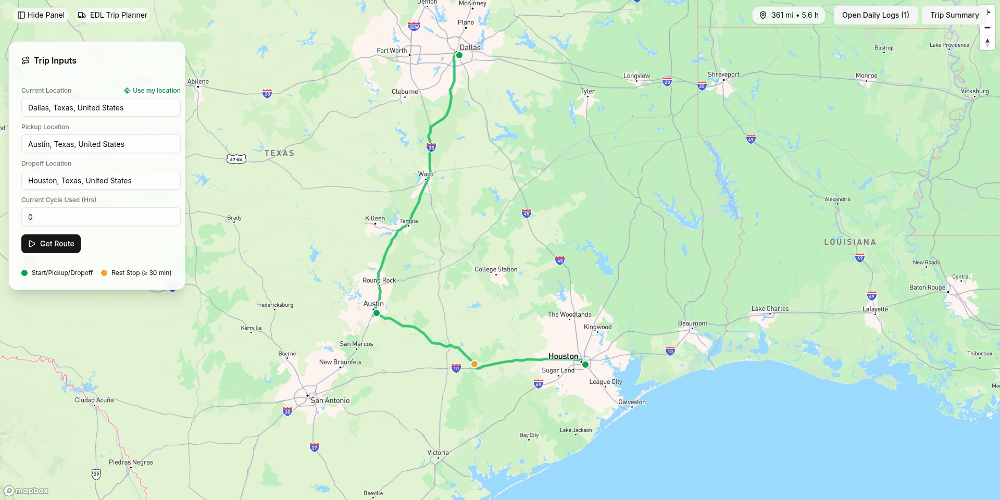

# Spotter — ELD Trip Planner

A app that turns a pickup/dropoff route into driver predicted ELD‑style daily log sheets you can view, print, and export guaranteeing FMCSA compliance.

- Frontend: React Router + Tailwind, ShadcnUI, Vite dev server
- Backend: Django 5, simple endpoint for planning and logs
- Maps: Mapbox GL JS (frontend) and Mapbox Directions (backend)

This README explains how it works end‑to‑end, how to run it locally, and where key pieces live.

## Technical overview 

At a high level:

- Input: The user enters three stops (Current, Pickup, Dropoff). The client uses Mapbox Geocoding to turn text into coordinates.
- Plan: The client sends those waypoints to the backend’s unified endpoint (`POST /api/plan-route/`).
- Route: The backend fetches Mapbox Directions (meters/seconds + GeoJSON geometry).
- ELD logic: A pure planner function turns the route into absolute duty-status segments (OND/DRIVE/SB/OFF) and splits them into per-day minute offsets for the 24‑hour grid.
- UI: The frontend renders the map route plus a Daily Log sheet for each day (printable/exportable). Rest breaks are derived and visualized.

Key pieces and how they fit together:

- Client (React + Vite)
  - Map UI (`app/components/map/MapBackground.tsx`) renders the returned route geometry and key markers.
  - Trip panel (`app/components/map/SideBarPanel.tsx`) manages the three stops and autocomplete.
  - Daily logs (`app/components/log/DailyLogDialog.tsx`) draw the DOT‑style 24‑hour grid from per‑day segments and support print/PNG export.
  - API wrapper (`app/lib/api.ts`) calls `/api/plan-route/` and handles CSRF.
  - Env: `VITE_MAPBOX_TOKEN` enables geocoding and map tiles on the client.

- Server (Django) - [edl-backend](https://github.com/AbogeJr/edl-backend)
  - Endpoint (`logs/views.py`): `/api/plan-route/` accepts waypoints and orchestrates directions + planning.
  - Directions (`logs/mapbox.py`): small stdlib client to Mapbox Directions; token via `MAPBOX_TOKEN`.
  - Planner (`logs/planner.py`): pure function that models pickup/drive/break/drop‑off and splits across days for rendering.
  - Settings: CORS/CSRF configured for local dev; static served via WhiteNoise; DATABASE_URL support for Postgres.

- Data contract
  - Request: `{ waypoints: [{lat,lng}, ...], avg_mph?, start_ts? }`
  - Response: `{ route: {distance_m, duration_s, geometry}, segments: Absolute[], days: [{date, segments: MinuteOffsets[]}] }`

